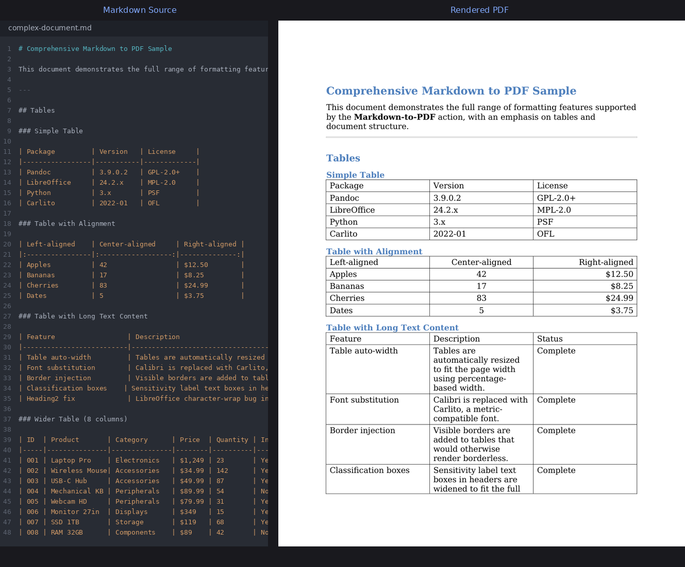

<p align="center">
  
</p>

# Markdown/Word to PDF

A GitHub Action that converts Markdown or Word (`.docx`/`.doc`) files
to PDF. Markdown files are first converted to `.docx` via
[Pandoc](https://pandoc.org/), then the Word document is converted to PDF using
[LibreOffice](https://www.libreoffice.org/) in headless mode.



The PDF preserves the document's layout, fonts, and template styling, which is
not possible with a separate Pandoc/LaTeX render.

## Usage

### From a Markdown file

```yaml
- name: Convert Markdown to PDF
  uses: bryanpaget/markdown-to-pdf@main
  with:
    markdown_file: "docs/readme.md"
    pdf_file: "output/readme.pdf"
```

### From a Word document

```yaml
- name: Convert Word to PDF
  uses: bryanpaget/markdown-to-pdf@main
  with:
    docx_file: "output/document.docx"
    pdf_file: "output/document.pdf"
```

## Inputs

| Input             | Required | Description                                             |
|-------------------|----------|---------------------------------------------------------|
| `docx_file`       | no       | Path to the source Word document (.docx/.doc).          |
| `markdown_file`   | no       | Path to a Markdown file (auto-converted to .docx first).|
| `pdf_file`        | yes      | Path where the resulting PDF should be written.         |
| `code_block_style`| no       | When `"true"`, code blocks render with a light background and smaller font. Default `"false"`. |

Provide either `docx_file` or `markdown_file` (not both).

## Outputs

| Output    | Description                                  |
|-----------|----------------------------------------------|
| `pdf_file`| Resolved path to the generated PDF.          |

## Sample PDFs

Pre-built sample PDFs are attached to each
[release](https://github.com/bryanpaget/markdown-to-pdf/releases). They are
generated from [`samples/complex-document.md`](samples/complex-document.md) —
a document with tables, code blocks, lists, blockquotes, embedded financial
charts, and extensive formatting. Both the Markdown→PDF and DOCX→PDF
paths are included.

To generate them locally:

```bash
pandoc samples/complex-document.md --resource-path=samples -o complex-document.docx
python3 fix-docx-tables.py complex-document.docx
soffice --headless --convert-to pdf complex-document.docx
```

## Requirements

- `libreoffice-writer` (auto-installed if missing)
- `pandoc` (auto-installed if using `markdown_file`)

## License

GPL or similar
