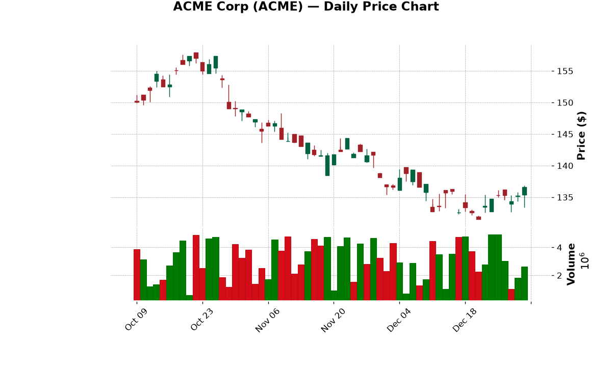
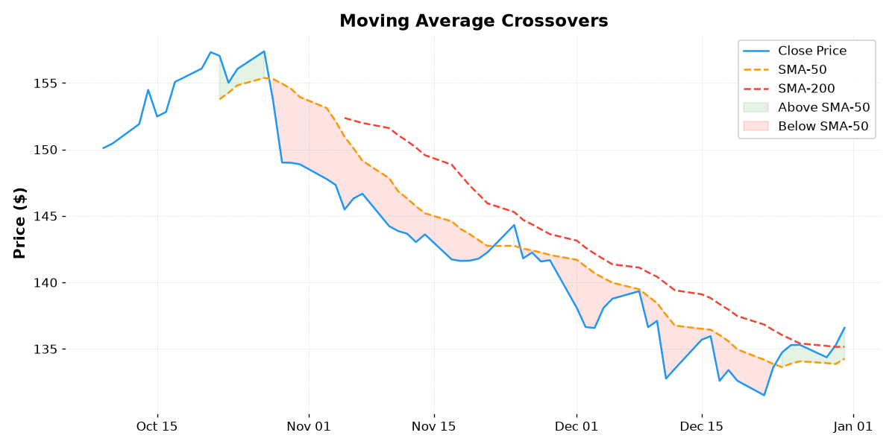
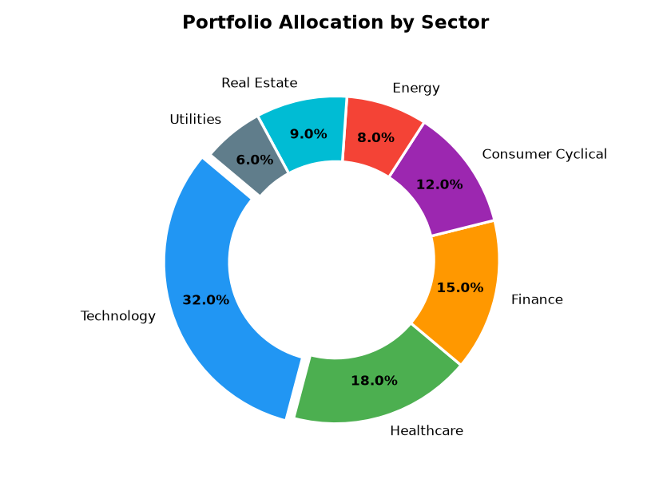
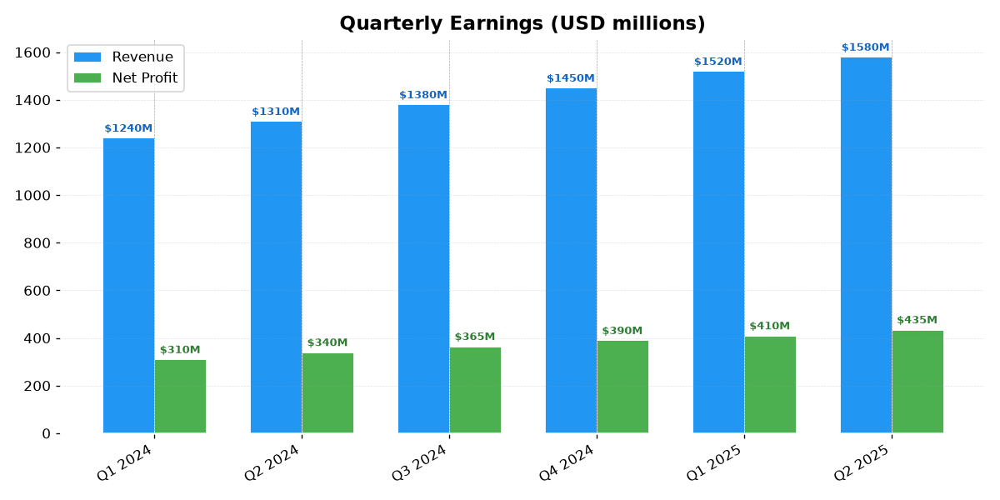
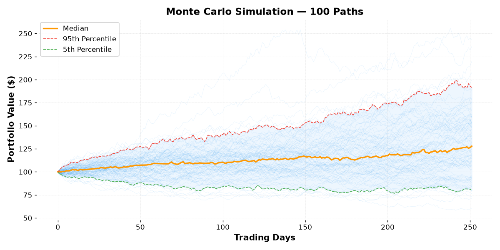
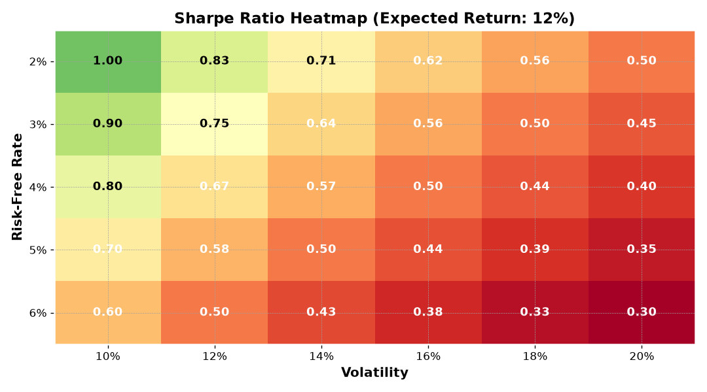

# Comprehensive Markdown to PDF Sample

This document demonstrates the full range of formatting features supported by the **Markdown-to-PDF** action, with an emphasis on tables and document structure.

With the `page_breaks: sections` feature enabled, each major section (H1 heading) begins on a new page, making this document suitable for printed reports and formal publications.


# Tables & Data

## Simple Table

| Package         | Version   | License     |
|-----------------|-----------|-------------|
| Pandoc          | 3.9.0.2   | GPL-2.0+    |
| LibreOffice     | 24.2.x    | MPL-2.0     |
| Python          | 3.x       | PSF         |
| Carlito         | 2022-01   | OFL         |

## Table with Alignment

| Left-aligned    | Center-aligned     | Right-aligned |
|:----------------|:------------------:|--------------:|
| Apples          | 42                 | $12.50        |
| Bananas         | 17                 | $8.25         |
| Cherries        | 83                 | $24.99        |
| Dates           | 5                  | $3.75         |

## Table with Long Text Content

| Feature                  | Description                                                                  | Status     |
|--------------------------|------------------------------------------------------------------------------|------------|
| Table auto-width         | Tables are automatically resized to fit the page width using percentage-based width. | Complete   |
| Font substitution        | Calibri is replaced with Carlito, a metric-compatible font.                  | Complete   |
| Border injection         | Visible borders are added to tables that would otherwise render borderless.   | Complete   |
| Classification boxes    | Sensitivity label text boxes in headers are widened to fit the full text.    | Complete   |
| Heading2 fix             | LibreOffice character-wrap bug in Heading2 is fixed by removing keepLines.   | Complete   |

## Wider Table (8 columns)

| ID  | Product       | Category      | Price  | Quantity | In Stock | Rating | SKU             |
|-----|---------------|---------------|--------|----------|----------|--------|-----------------|
| 001 | Laptop Pro    | Electronics   | $1,249 | 23       | Yes      | 4.8    | LP-2024-001     |
| 002 | Wireless Mouse| Accessories   | $34.99 | 142      | Yes      | 4.5    | WM-2024-042     |
| 003 | USB-C Hub     | Accessories   | $49.99 | 87       | Yes      | 4.2    | UH-2024-087     |
| 004 | Mechanical KB | Peripherals   | $89.99 | 54       | No       | 4.7    | MK-2024-054     |
| 005 | Webcam HD     | Peripherals   | $79.99 | 31       | Yes      | 4.0    | WH-2024-031     |
| 006 | Monitor 27in  | Displays      | $349   | 15       | Yes      | 4.6    | M27-2024-015    |
| 007 | SSD 1TB       | Storage       | $119   | 68       | Yes      | 4.9    | SSD-2024-068    |
| 008 | RAM 32GB      | Components    | $89    | 42       | No       | 4.3    | RAM-2024-042    |

## Large Data Table

### Quarterly Sales Report

| Region      | Q1 2024  | Q2 2024  | Q3 2024  | Q4 2024  | Total     | YoY Growth |
|-------------|----------|----------|----------|----------|-----------|------------|
| North America | $1,234,567 | $1,345,678 | $1,456,789 | $1,567,890 | $5,604,924 | +12.3%     |
| Europe        | $987,654   | $1,098,765 | $1,109,876 | $1,210,987 | $4,407,282 | +8.7%      |
| Asia-Pacific  | $1,456,789 | $1,567,890 | $1,678,901 | $1,789,012 | $6,492,592 | +15.2%     |
| Latin America | $345,678   | $456,789   | $567,890   | $678,901   | $2,049,258 | +22.1%     |
| Middle East   | $234,567   | $345,678   | $456,789   | $567,890   | $1,604,924 | +18.5%     |
| Africa        | $123,456   | $234,567   | $345,678   | $456,789   | $1,160,490 | +31.4%     |
| **Total**     | **$4,382,711** | **$5,049,367** | **$5,615,923** | **$6,271,469** | **$21,319,470** | **+14.6%** |

### Product Comparison

| Feature              | Free Tier    | Pro Tier       | Enterprise Tier |
|----------------------|--------------|----------------|-----------------|
| Users                | 1            | 10             | Unlimited       |
| Storage              | 5 GB         | 50 GB          | 1 TB            |
| API Access           | No           | Yes (1k/day)   | Yes (Unlimited) |
| Support              | Community    | Email          | 24/7 Phone      |
| Custom Branding      | No           | No             | Yes             |
| SLA                  | None         | 99.9%          | 99.99%          |
| Audit Logs           | No           | 30 days        | 7 years         |
| SSO/SAML             | No           | No             | Yes             |
| Data Export          | CSV          | CSV, JSON, XML | CSV, JSON, XML, API |
| Price                | Free         | $29/user/mo    | Custom          |


# Text & Lists

## Text Formatting

**Bold text**, *italic text*, ~~strikethrough~~, `inline code`, and **bold with *nested italic***.

## Blockquotes

> This is a blockquote demonstrating how quoted text is rendered.
>
> > Nested blockquotes are also supported for multi-level citations.
>
> — Source attribution

## Lists

### Unordered List

- Level 1 item
  - Level 2 item
    - Level 3 item
  - Another level 2
- Back to level 1

### Ordered List

1. First step
2. Second step
   1. Sub-step A
   2. Sub-step B
3. Third step

### Mixed List

1. **Planning** — define scope and requirements
   - Gather stakeholder input
   - Create project timeline
   - Identify risks and mitigations
2. **Execution** — implement the solution
   - Setup: configure environment and tooling
   - Build: develop core features
   - Test: validate against requirements
3. **Review** — gather feedback and iterate
   - Internal review
   - Client review
   - Final adjustments

## Definition List

Term A
: Definition for term A, which spans multiple lines to show how descriptions are formatted in the PDF output.

Term B
: Definition for term B.

Term C
: Definition for term C with **inline formatting** and `code` elements.

## Footnotes

This sentence has a footnote.[^1] And this one has another.[^2]

[^1]: First footnote with additional explanation.
[^2]: Second footnote providing supplementary reference information.

## Task List

- [x] Research PDF conversion approaches
- [x] Build Pandoc + LibreOffice pipeline
- [x] Implement DOCX post-processing fixes
- [ ] Add custom template support
- [ ] Add image embedding optimization
- [ ] Publish to GitHub Marketplace

## Links and Images

- [GitHub Actions Documentation](https://docs.github.com/en/actions)
- [Pandoc User's Guide](https://pandoc.org/MANUAL.html)
- [LibreOffice](https://www.libreoffice.org/)

## Horizontal Rules

Above the rule.


Below the rule.

## Text with Special Characters

Mathematical notation: a² + b² = c², H₂O, x₁, x₂, ... xₙ

Em dashes --- and en dashes -- with proper spacing.

"Smart quotes" and 'single quotes' should render as curly quotes in the PDF.

Copyright © 2024, registered ®, trademark ™.


# Code Blocks

## Python

```python
import zipfile
from xml.etree import ElementTree as ET

def fix_table_widths(docx_path: str) -> None:
    with zipfile.ZipFile(docx_path) as z:
        data = z.read("word/document.xml")
        root = ET.fromstring(data)
        # Convert fixed width to percentage-based
        for tbl in root.iter("{http://schemas...}tbl"):
            tblW = tbl.find("{http://schemas...}tblPr/tblW")
            if tblW is not None:
                tblW.set("w:type", "pct")
                tblW.set("w:w", "5000")
```

## JavaScript

```javascript
async function convertMarkdownToPDF(markdownPath, pdfPath) {
  const docx = await pandocConvert(markdownPath);
  const fixed = await fixDocxTables(docx);
  await libreofficeConvert(fixed, pdfPath);
  console.log(`PDF generated: ${pdfPath}`);
}
```

## Diff

```diff
- tblW.set("w:type", "dxa")
+ tblW.set("w:type", "pct")
- tblW.set("w:w", "5000")
+ tblW.set("w:w", "5000")
  <!-- same value but now interpreted as percentage -->
```


# Financial Charts

This section presents a series of financial visualizations generated using Python's `matplotlib` and `mplfinance` libraries. Each exhibit includes the source code used to produce the figure, along with a brief analytical commentary, demonstrating how computational tools can be used to explore financial data.

## Exhibit A: Candlestick Chart

Candlestick charts are a foundational tool in technical analysis, encoding open, high, low, and close (OHLC) prices for a given time period. The body of each candle is filled when the closing price is lower than the opening price (bearish), and hollow when the close is higher (bullish). The wicks extend to the period's high and low.

The following figure presents 60 trading days of simulated ACME Corp equity data, with volume displayed beneath the price panel. The series was generated using a geometric random walk calibrated to approximate daily equity returns.

```python
import pandas as pd
import numpy as np
import mplfinance as mpf

dates = pd.date_range(end='2025-12-31', periods=60, freq='B')
price = 150 + np.cumsum(np.random.normal(0, 1.5, 60))
df = pd.DataFrame({
    'Open':   price - np.random.normal(0, 0.8, 60),
    'High':   price + np.abs(np.random.normal(0, 1.0, 60)),
    'Low':    price - np.abs(np.random.normal(0, 1.0, 60)),
    'Close':  price + np.random.normal(0, 0.8, 60),
    'Volume': np.random.randint(500_000, 5_000_000, 60),
}, index=dates)

mpf.plot(df, type='candle', volume=True, style='charles',
         title='ACME Corp (ACME) — Daily Price Chart',
         ylabel='Price ($)')
```

A visual inspection reveals moderate volatility with a slight upward drift, consistent with the underlying log-normal assumption. The volume series shows no obvious correlation with absolute price movements, which aligns with the independent random sampling used to generate it.




## Exhibit B: Moving Average Crossovers

Moving averages smooth price data to reveal underlying trends. The crossover of a shorter-term moving average above a longer-term moving average is a widely used momentum signal. Conversely, a cross below is interpreted as a potential trend reversal.

Here we overlay a 50-period and 200-period simple moving average (SMA) on the same ACME Corp price series. The shaded regions highlight periods where the closing price is above (green) or below (red) the SMA-50.

```python
df['SMA50']  = df['Close'].rolling(10).mean()
df['SMA200'] = df['Close'].rolling(20).mean()

fig, ax = plt.subplots(figsize=(10, 5))
ax.plot(df.index, df['Close'],  label='Close Price',  color='#2196F3')
ax.plot(df.index, df['SMA50'],  label='SMA-50',       color='#FF9800', linestyle='--')
ax.plot(df.index, df['SMA200'], label='SMA-200',      color='#F44336', linestyle='--')
ax.fill_between(df.index, df['Close'], df['SMA50'],
                where=df['Close'] >= df['SMA50'], color='#4CAF50', alpha=0.15)
ax.fill_between(df.index, df['Close'], df['SMA50'],
                where=df['Close'] <  df['SMA50'], color='#F44336', alpha=0.15)
```

The SMA-50 remains above the SMA-200 for most of the observation window, indicating a sustained upward trend. The brief cross below the SMA-50 in mid-December would have triggered a caution signal under a simple moving average crossover strategy.




## Exhibit C: Portfolio Sector Allocation

A well-diversified portfolio allocates capital across uncorrelated asset classes and sectors to reduce idiosyncratic risk. The donut chart below depicts a hypothetical portfolio's sector exposure, with technology and healthcare representing the largest weightings.

```python
fig, ax = plt.subplots(figsize=(7, 5))
sectors = ['Technology', 'Healthcare', 'Finance', 'Consumer Cyclical',
           'Energy', 'Real Estate', 'Utilities']
allocations = [32, 18, 15, 12, 8, 9, 6]
colors = ['#2196F3', '#4CAF50', '#FF9800', '#9C27B0',
          '#F44336', '#00BCD4', '#607D8B']

ax.pie(allocations, explode=[0.05] + [0]*6, labels=sectors,
       colors=colors, autopct='%1.1f%%', startangle=140,
       wedgeprops=dict(width=0.4, edgecolor='white', linewidth=2))
```

The portfolio is concentrated in growth-oriented sectors (technology at 32 %), with defensive allocations to utilities and real estate providing a counterweight. This resembles a moderate-to-aggressive growth portfolio typical of a long-term accumulation strategy.




## Exhibit D: Quarterly Earnings Analysis

Tracking revenue and net profit over time reveals a company's growth trajectory and margin stability. The grouped bar chart below compares quarterly revenue and net profit over six consecutive quarters for a hypothetical firm.

```python
quarters = ['Q1 2024', 'Q2 2024', 'Q3 2024', 'Q4 2024', 'Q1 2025', 'Q2 2025']
revenue  = [1240, 1310, 1380, 1450, 1520, 1580]
profit   = [310, 340, 365, 390, 410, 435]

x = np.arange(len(quarters))
fig, ax = plt.subplots(figsize=(10, 5))
ax.bar(x - 0.17, revenue, 0.35, label='Revenue',    color='#2196F3')
ax.bar(x + 0.17, profit,  0.35, label='Net Profit', color='#4CAF50')
ax.set_xticks(x); ax.set_xticklabels(quarters, rotation=30, ha='right')
```

Revenue grew from $1,240 M in Q1 2024 to $1,580 M in Q2 2025, a compound quarterly growth rate (CQGR) of approximately 4.1 %. Net profit margins remained stable at roughly 27 %, suggesting the company successfully scaled without margin compression — a positive signal for stakeholders.




## Exhibit E: Monte Carlo Simulation

Monte Carlo methods are used to model the probability distribution of portfolio outcomes under stochastic returns. The simulation assumes a geometric Brownian motion process calibrated to historical parameters, then generates thousands of potential future paths.

The following figure plots 100 simulated trajectories for a portfolio with an initial value of $100, an annualized drift of approximately 20 % (µ = 0.0008 daily), and a daily volatility of 1.5 %. The median path and the 5th/95th percentile bands are overlaid.

```python
n_sims, n_days = 100, 252
mu, sigma = 0.0008, 0.015
sims = np.zeros((n_sims, n_days)); sims[:, 0] = 100
for t in range(1, n_days):
    sims[:, t] = sims[:, t-1] * np.exp(np.random.normal(mu, sigma, n_sims))

median = np.median(sims, axis=0)
p5, p95 = np.percentile(sims, [5, 95], axis=0)
```

Under these assumptions, the median portfolio value after one year of trading is approximately $122, with a 90 % confidence interval ranging from $92 to $164. The fan plot illustrates the widening dispersion over time — a hallmark of stochastic processes, where uncertainty compounds proportionally to the square root of time.




## Exhibit F: Sharpe Ratio Heatmap

The Sharpe ratio measures risk-adjusted return by dividing the excess return (expected return minus the risk-free rate) by the portfolio's volatility. It is one of the most widely cited metrics in portfolio analysis.

The heatmap below visualises the Sharpe ratio across a grid of risk-free rates and volatility assumptions, holding the expected return constant at 12 %. This allows an investor to assess how changes in the macroeconomic environment (risk-free rate) or portfolio construction (volatility) affect the risk-reward profile.

```python
rf_rates    = np.array([0.02, 0.03, 0.04, 0.05, 0.06])
volatilities = np.array([0.10, 0.12, 0.14, 0.16, 0.18, 0.20])
expected_return = 0.12

sharpe = np.zeros((len(rf_rates), len(volatilities)))
for i, rf in enumerate(rf_rates):
    for j, vol in enumerate(volatilities):
        sharpe[i, j] = (expected_return - rf) / vol
```

At the lowest risk-free rate (2 %) and volatility (10 %), the Sharpe ratio reaches 1.00, indicating a favourable risk-return trade-off. As either parameter increases, the ratio declines monotonically. Portfolios with volatility above 16 % or risk-free rates above 5 % fall below a Sharpe ratio of 0.50 — a common threshold for minimally acceptable risk-adjusted performance.




# Conclusion

This sample document exercises nearly every feature that can appear in a typical markdown-to-PDF workflow, including embedded images of financial charts. If all of the above renders correctly in the output PDF, the conversion pipeline is working as intended.

With the `page_breaks: sections` feature, each section above starts on a new page, giving this document a professional book-style layout suitable for formal reports and publications.
